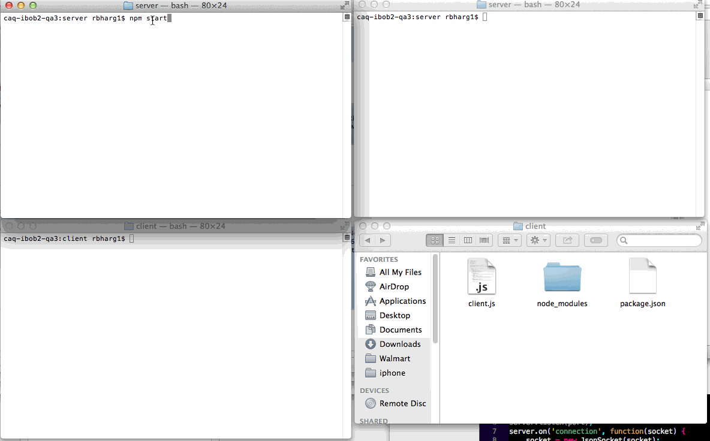

DrobBoxNodeJs
=======================
The goal for this week's assignment is to build a Dropbox Clone, which is a fancy way of saying a directory that exists in multiple locations that is kept in sync to be a perfect mirror. If a file is added to the server directory, it should get pushed to the client and appear in the client's directory.

Time spent:  12 hours spent in total

 User Stories: 
  Server: 
- [x] Setup an HTTP server listening on port 8000.
- [x] Implement an HTTP route for FILES for GET, HEAD, PUT, POST, DELETE
- [x] Implement an HTTP route for DIR for GET, HEAD, PUT, POST, DELETE
- []  (Optional) Use HTTPS by defulat, and redirect from HTTP (Optional) (Not completed)
- [x] CLI support added. (bode index.js --dir /some/root/dir)
- [x] Add TCP support. PUT, POST and DELETE update to connected clients is done using json. (json-socket used)
- [x] It watches for changes in the root folder and sends update to the clients using Chokidar.
- [] (Optional) Create, delete or update files when the corresponding packets are received from clients (Optional)(Not completed)
-  Add FTP support so that an FTP client can be used to access the files (Optional)(Not completed)
 
  Client:
- [x] Use CWD as the root 
- [x] Connect to the server using TCP
- [x] Create, delete or update the contents of files when the corresponding packets are received from the server
- [] (optional) Watch the CWD for file changes with (Optional) (Not completed)
- [] (optional) Support conflict resolution (Optional) (Not completed)
- [x] Add CLI 

#How to Use. 
1. git clone
2. cd DrobBoxNodejs
3. cd server, npm install, npm start - This will run the server. 
4. open antoher teriminal. curl -v http://localhost:8000/index.js -X GET (it has support for GET, PUT, POST, HEAD and DELETE)
5. For TCP. Open another termial. cd to dropBoxNode.js, cd client. 
6. Run client: cd client, npm install, npm start
7. The client will get updates by the server when any files are created, updated or deleted. 

Known issue.
1. In the client.js filepath is not being sent to the delete and update methods. Create works well.
2. Express server on GET of file, gives me this error. Excess found in a non pipelined read: excess = 14 url = /test.txt (zero-length body)

TCP SERVER

